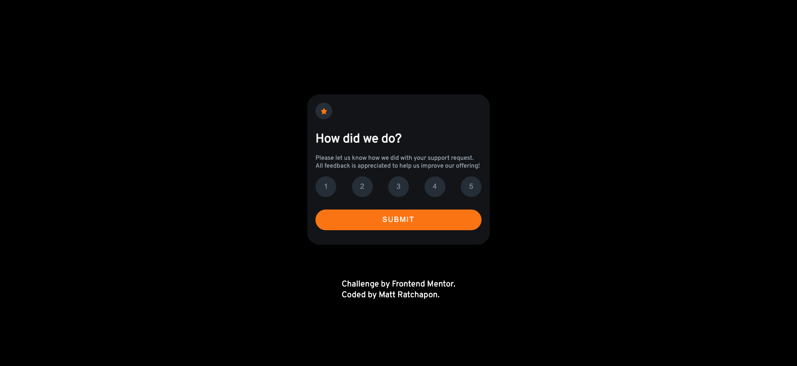

# Frontend Mentor - Interactive rating component solution

This is a solution to the [Interactive rating component challenge on Frontend Mentor](https://www.frontendmentor.io/challenges/interactive-rating-component-koxpeBUmI). Frontend Mentor challenges help you improve your coding skills by building realistic projects.

## Table of contents

- [Overview](#overview)
  - [The challenge](#the-challenge)
  - [Screenshot](#screenshot)
  - [Links](#links)
- [My process](#my-process)
  - [Built with](#built-with)
  - [What I learned](#what-i-learned)
  - [Continued development](#continued-development)
  - [Useful resources](#useful-resources)
- [Author](#author)
- [Acknowledgments](#acknowledgments)

## Overview

### The challenge

Users should be able to:

- View the optimal layout for the app depending on the device's screen size
- See hover states for all interactive elements on the page
- Select and submit a number rating
- See the "Thank you" card state after submitting a rating

### Screenshot



### Links

- Solution URL: [Add solution URL here](https://github.com/bbenbboy/1.-interactive-rating-component-main.git)
- Live Site URL: [Add live site URL here](https://interactive-rating-component-main-beige.vercel.app/)

## My process

### Built with

- Semantic HTML5 markup
- CSS custom properties
- Flexbox
- CSS Grid
- Mobile-first workflow

### What I learned

This is the second time I rewrote this project to improve performance.

```js
submitBtn.addEventListener("click", (event) => {
  event.preventDefault();

  const btnActive = buttonContainer.querySelector(".active");

  if (btnActive) {
    scoreRate.textContent = score;
    card1.classList.add("hidden");
    card2.classList.remove("hidden");
  } else {
    alert("Please give a point");
  }
});
```

```js
buttons.forEach((button) => {
  button.addEventListener("click", () => {
    buttons.forEach((btn) => {
      btn.classList.remove("active");
    });
    button.classList.add("active");
    score = button.value;
  });
});
```

### Continued development

None

### Useful resources

None

## Author

- Website - [My Resume](https://rcp-portfolio.vercel.app/)
- Frontend Mentor - [@bbenbboy](https://www.frontendmentor.io/profile/bbenbboy)

## Acknowledgments

None
